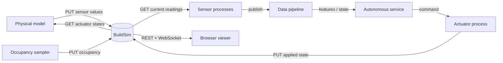

# BuildSim for the D7065E lab

BuildSim is the shared environment for the lab. It stores the current building,
equipment, sensor values, actuator states, occupancy, and viewer overlays. It
does not simulate physics, generate occupancy, or retain a time series; the
student project supplies those parts.



## 1. Start one local server per pair

```bash
cd buildingsim
go run ./cmd start
```

Open <http://127.0.0.1:9090>. The server deliberately listens only on the
student's laptop by default. Equipment and live state reset on restart, so each
pair should keep a Go seed program or script that can recreate its setup.

The modern 3D interface is the default. `--ui classic` selects the original
interface; both use the same backend.

Or start the supplied container:

```bash
docker compose up --build
```

The browser still uses `http://127.0.0.1:9090`. Services in that Compose
network use `http://buildsim:9090`. Loopback inside a container points to the
container itself, so `http://127.0.0.1:9090` will not reach BuildSim from a
different container.

If a pair deliberately needs to reach BuildSim from another computer on the
same trusted LAN, restart it with `go run ./cmd start --all-interfaces` and open
the laptop's LAN address from the other machine. BuildSim has no authentication,
so do not use this flag on an untrusted network.

## 2. Register equipment

Every equipment item must name an existing floor and room. A single bulk call
can register equipment, sensors, and actuators atomically:

```bash
curl -X POST http://127.0.0.1:9090/api/equipment/bulk \
  -H 'Content-Type: application/json' -d '[
  {
    "id": "hvac-A109",
    "name": "HVAC A109",
    "type": "ac_unit",
    "category": "hvac",
    "level": "level0",
    "room": "A109",
    "status": "running",
    "sensors": [
      {"id":"A109-temp","name":"Temperature","type":"temperature","data_type":"text","unit":"°C","value":"21.0"},
      {"id":"A109-co2","name":"CO2","type":"co2","data_type":"text","unit":"ppm","value":"650"}
    ],
    "actuators": [
      {"id":"A109-setpoint","name":"Heating setpoint","type":"setpoint","state":"21"},
      {"id":"A109-damper","name":"Ventilation damper","type":"fan_speed","state":"0"}
    ]
  }
]'
```

Bulk creation is idempotent for existing equipment IDs. The complete request is
rejected if a new nested sensor or actuator ID conflicts, so it cannot leave a
half-created setup.

## 3. Close the simulation loop

Sensor values and actuator states are strings. A typical loop is:

```text
# Physical model tick
occupancy = GET /api/occupancy
damper    = GET /api/actuators/A109-damper
co2       = step(previous_co2, occupancy, damper.state)
PUT /api/sensors/A109-co2/value {"data_type":"text","value":"..."}

# Autonomous decision service
co2       = GET /api/sensors/A109-co2
decision  = decide(co2.value)
POST http://actuator-a109:8080/commands {"state":"...","reason":"..."}

# Independently deployable actuator process
command = validate_authority_and_range(request)
PUT /api/actuators/A109-damper/state {"state":"..."}
```

The decision service does not impersonate the device by writing to BuildSim
directly. It commands an independently deployable actuator process, which owns
validation, application, retries, and reporting. The physical model must then
read actuator state back from BuildSim. Otherwise the decision cannot affect
the next simulated measurement.

Every successful mutation automatically notifies both viewers; students do not
need to call `/api/equipment/notify`.

## 4. Use floor-qualified room keys

Occupancy is a map keyed by `<level>/<room-name>`:

```bash
curl -X PUT http://127.0.0.1:9090/api/occupancy \
  -H 'Content-Type: application/json' -d '{
  "level0/A109": {
    "persons": [{"id":"p1","name":"Alice"}],
    "aliens": []
  }
}'
```

Equipment uses the same two components in separate fields. Highlights and
coverage zones also carry `level` and `room`. Numeric room IDs are retained as
a compatibility input, but they can repeat on different floors; new project
code should use floor-qualified room names.

## 5. Publish physical state and visible effects

Use sensors for device observations. Use room layers for simulated or estimated
room state, and effects for visible phenomena. For example, a fire simulator
might publish a room temperature field and a smoke plume after each simulation
tick:

```bash
curl -X PUT http://127.0.0.1:9090/api/room-layers \
  -H 'Content-Type: application/json' -d '[{
  "id":"temperature","label":"Simulated temperature","unit":"°C",
  "source":"simulation truth","minimum":18,"maximum":40,
  "values":{"level0/A109":38.2,"level0/A110":29.6}
}]'

curl -X PUT http://127.0.0.1:9090/api/effects \
  -H 'Content-Type: application/json' -d '[{
  "id":"fire-A109","type":"fire","level":"level0","room":"A109",
  "radius":7,"height":15,"intensity":0.9
}]'
```

BuildSim renders these values; it does not calculate them. The physical model
must evolve temperature, smoke, gas, water, or other state and publish the next
snapshot. The same principle applies to entity movement, room illumination,
and current decision alerts.

For a standalone heatmap example with values across several rooms, run:

```bash
./examples/api/room-layers/set_temperature_heatmap.sh
```

Open <http://127.0.0.1:9090/?layer=temperature&floor=level0>. Edit the
`values` map in the script or publish a new complete snapshot from the physical
simulator on every simulation tick.

The complete runnable example also shows exact equipment positions, a moving
person and cleaning robot, an illuminated room, an exterior entrance, a fire
exit, and a locked room door:

```bash
./examples/api/scenario/show_visual_effects.sh
```

Open
<http://127.0.0.1:9090/?layer=temperature&floor=level0&room=A109>.
See [Simulation and visualization state](api/visualization.md) and
[Entrances, doors, and locks](api/doors.md) for the request formats.

<!-- The images below are real captures produced from the example above. -->
<p>
  
  
</p>

## 6. Drive a browser session

The viewer creates a session when it opens. Click the session chip at the upper
left to copy its full ID, or find the newest active session and push an overlay:

```bash
SESSION=$(curl -s http://127.0.0.1:9090/api/sessions | python3 -c '
import json, sys
s = sorted(json.load(sys.stdin), key=lambda x: x.get("last_ws_active", ""))
print(s[-1]["id"] if s else "")
')

if [ -z "$SESSION" ]; then
  echo "No viewer session found; open http://127.0.0.1:9090 first" >&2
  exit 1
fi

curl -X PUT "http://127.0.0.1:9090/api/sessions/$SESSION/highlights" \
  -H 'Content-Type: application/json' -d '[
  {"level":"level0","room":"A109","color":"#e53935","opacity":0.5}
]'
```

Viewport, highlights, occupancy, coverage, and routes are delivered live over
the session WebSocket. Global occupancy and coverage endpoints broadcast to all
viewers; session endpoints affect only one viewer.

## Endpoint map

| Lab concept | BuildSim endpoint |
|---|---|
| Discover floors and rooms | `GET /api/building`, `GET /api/building/floors/{level}` |
| Register equipment | `POST /api/equipment` or `/api/equipment/bulk` |
| Attach children | `POST /api/equipment/{id}/sensors` or `/actuators` |
| Read/write a sensor | `GET /api/sensors/{id}`, `PUT /api/sensors/{id}/value` |
| Read/write an actuator | `GET /api/actuators/{id}`, `PUT /api/actuators/{id}/state` |
| Global occupancy | `GET/PUT /api/occupancy` |
| Scalar room state and risk | `GET/PUT /api/room-layers` |
| Fire, smoke, gas, sprinkler, water, warning | `GET/PUT /api/effects` |
| Moving people and robots | `GET/PUT /api/entities` |
| Room illumination | `GET/PUT /api/room-appearance` |
| Entrances, doors, and route-affecting locks | `GET/PUT /api/doors` |
| Current decision output | `GET/PUT /api/alerts` |
| Optional movement route | `GET /api/graph/route` |
| One browser overlay | `PUT /api/sessions/{id}/{viewport,highlights,occupancy,coverage,route}` |

The Go package [`pkg/client`](../pkg/client/) and
[`examples/go-client`](../examples/go-client/) provide a standard-library
starting point. Full request and response shapes are in the [API
reference](api/README.md).

## Boundaries to state in the report

- BuildSim stores current state; the project owns physics, control logic,
  occupancy and movement generation, persistence, and time-series analysis.
- A room layer is physical/estimated state, a sensor is an observation, and a
  visual effect is a rendering instruction. State their relationship instead
  of treating the three as interchangeable.
- BuildSim has no authentication and is a local lab tool, not a deployment
  platform.
- The autonomous service and actuator process are separate responsibilities:
  proposing a command is not the same as validating and applying it.
- The browser viewer is provided infrastructure. Explain what project state is
  mapped into it instead of claiming the viewer itself as a student-built
  component.
